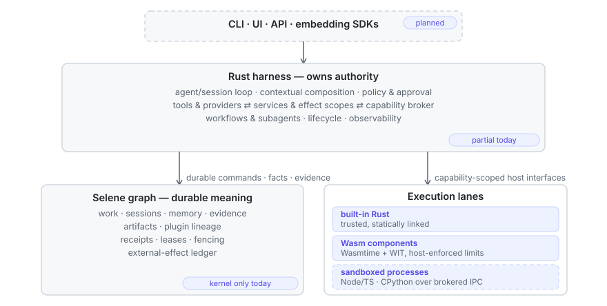
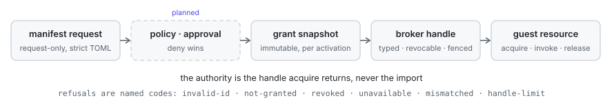

<h1>
  <picture>
    <source media="(prefers-color-scheme: dark)" srcset="docs/assets/yah-banner-dark.svg">
    
  </picture>
</h1>

[](https://github.com/jscott3201/yet-another-harness/actions/workflows/ci.yml)
[](LICENSE-MIT)

YAH is an agent harness being built in Rust. The Rust host owns runtime truth,
composition, policy, and every extension boundary, and the design routes
everything durable — work, sessions, memory, evidence, artifacts, external
effects — into one queryable graph (Selene, the storage engine the workspace
pins to an exact public revision) rather than a collection of unrelated logs.
The project is mid-pivot: it began as a narrow reliability kernel, and that
kernel now underpins this larger architecture as a foundation, not a frozen
specification.

> **Status: pre-0.1 and not ready for use.** There is no installable daemon,
> live agent loop, plugin package loading, sandbox, or end-user client yet.
> APIs and crate boundaries will change. What does exist is tested and labeled
> exactly: [project status](docs/project-status.md) records the implemented
> boundary, including what each test corpus does *not* prove.

## Why another harness

Most harnesses are one privileged loop surrounded by callbacks. YAH treats the
harness as a composition of replaceable components: model adapters, tools,
prompt and context contributors, memory strategies, subagent drivers,
execution backends, policies, and user surfaces all attach through explicit
capabilities. Four properties define the target:

- **Rust owns authority.** Lifecycle, policy, durable state transitions,
  permissions, recovery, and external-effect reconciliation stay in the Rust
  host. Guest code never holds the pen.
- **Selene stores durable meaning.** Work, attempts, sessions, memories,
  evidence, decisions, artifacts, plugin revisions, and provenance form one
  graph you can query, not logs you can only grep.
- **Plugins are first-class.** Built-in Rust components and sandboxed Wasm,
  TypeScript, and Python extensions share one semantic SDK surface; the
  isolation mechanism differs by lane, the vocabulary does not.
- **Composition is reactive.** Components declare what they provide and
  require. Activation, replacement, failure, and unload have scoped,
  reversible local effects — and a clean unload still cannot prove an external
  action never happened, which is why external effects get their own ledger.

## Target architecture

<picture>
  <source media="(prefers-color-scheme: dark)" srcset="docs/assets/architecture-dark.svg">
  
</picture>

This is the target shape, not the implemented boundary. Dashed elements are
unstarted, and the tagged boxes are partial: the harness's composition,
effect-scope, and capability machinery is tested today while the agent loop,
policy, and tools are not, and Selene holds the kernel's receipts, leases,
fencing, and effect ledger today while the work, session, and memory domains
are design-stage. [Project status](docs/project-status.md) draws the exact
line; the design detail — composition semantics, graph domains, effect
scopes, the plugin boundary, sandbox tiers, recovery — lives in
[architecture](docs/architecture.md).

## What works today

Everything below is enforced by the workspace test suite and the from-scratch
local gate, except the storage gate, which is a
recorded one-off run with its own report. Example guests are built from
source at gate time; no binary is committed.

**A live composition kernel** (`crates/yah-compose`). Component definition,
instance, and scope identities; epoch-fenced lifecycle so stale completions
and stop requests cannot cross incarnations; reversible effect scopes that
unwind registrations in deterministic reverse order; typed revocable services
with exact provider assignment; and desired-revision slots that replace a
component only after controlled removal. An independently authored
[conformance corpus](docs/composition-conformance.md) exercises the semantics,
and a deterministic fault corpus covers concurrent close, call draining,
callback unwind, and destructor panic containment.

**A plugin contract that precedes any runtime** (`crates/yah-plugin-host`).
A [strict manifest](docs/plugin-manifest.md) in which packages request
capabilities and never grant them; a runtime-neutral two-phase
[driver lifecycle](docs/plugin-driver.md) that admits cleanup before minting
the one start permit; an activation-scoped
[capability broker](docs/plugin-capabilities.md) mapping trusted request
subsets to exact typed handles that fail closed on revocation and
replacement; a reusable [driver conformance testkit](docs/plugin-driver-conformance.md);
and a runnable [authoring example](docs/plugin-authoring.md).

**A working Wasm lane** (`crates/yah-plugin-wasm`). A versioned
[WIT world](docs/wasm-plugin-contract.md) — WIT is the WebAssembly Component
Model's interface language — compiled into host and guest bindings from one
source; a Wasmtime driver where each activation owns its store and
deactivation drops it without asking the guest; and host-owned ceilings on
memory, tables, instances, live capability handles, guest stack and recursion
depth, call deadlines, and per-call transfer. Most ceilings are proved in
pairs — the same guest refused under a tight ceiling and admitted under a
generous one — and the ones that are not yet are named in
[project status](docs/project-status.md). Guest calls yield the thread at
every epoch tick, so a computing guest cannot starve its siblings.

**Capability transport across the ABI.** Brokered grants reach Wasm guests as
opaque resources: the authority is the handle `acquire` returns against the
activation's admitted grants, never the import, and refusal, revocation, and
fencing arrive as named codes a guest can observe and answer. Two example
plugins — one Rust built with `wit-bindgen`, one TypeScript built with `jco`,
from the same WIT — implement the same world and answer thirteen corpus
inputs identically, apart from the one field where each guest names itself,
through the same host — including the error renderings where the two
toolchains disagree most easily.

**Refusal before execution.** Malformed component bytes are refused with the
cause named. A component may not declare a root-level import the world does
not declare — checked before any store exists, closing a hole Wasmtime admits
on its own. Extra exports, nested-component imports, and compile-cost bounds
are documented gaps, not silent ones.

**A durability kernel** (`crates/yah-kernel`). Atomic Selene commits for
state, events, and receipts; authority and attempt epochs, leases, and
fencing; durable cancellation; external-effect preparation, dispatch
evidence, settlement, and parking for the uncertain case; provider stream
normalization fixtures for OpenAI Responses and Anthropic Messages shapes;
and a versioned JSON [protocol slice](docs/protocol.md) whose Rust types
generate checked-in JSON Schemas and TypeScript. A storage fan-in and crash-recovery gate
[passed 1,440 scored trials](docs/gates/G02-storage-fanin-recovery.md). These
mechanics predate the pivot and are integration candidates for the new
harness, not architectural authority.

**Not built yet:** the agent loop, model providers, daemon, CLI, UI, plugin
package loading and admission, and complete Node and Python process lanes. The
[wire protocol](docs/plugin-worker-protocol.md) is fixture-pinned, a supervised
process driver exposes an activation-scoped call/stream/artifact endpoint plus
bounded registered host methods and a portable text-capability bridge, and a
private TypeScript package now supplies framing and strict directional wire
admission. It does not supply handshake or session state, an authored worker,
fd-3 IO, the Promise/stream/cancellation/artifact/handle APIs, publication, or
sandbox enforcement. No CPython SDK exists. Also absent are the graph, memory,
and session domains beyond the kernel. The Wasm lane
bounds a guest's cost, not its authority:
guest code still runs in the host process, and no sandbox claim is made.

## Plugins and capabilities

A plugin manifest asks; it never receives. Grants are decided host-side,
snapshotted immutably per activation, and reach the guest as revocable typed
handles:

<picture>
  <source media="(prefers-color-scheme: dark)" srcset="docs/assets/capability-flow-dark.svg">
  
</picture>

A denied capability is an ordinary refusal the guest observes as data — never
a trap, and never a missing import that breaks instantiation. One semantic
plugin model spans the execution lanes; the isolation mechanism differs:

| Lane | Status | Intended use | Boundary |
|---|---|---|---|
| Built-in Rust | landed | First-party components and trusted integrations | Statically linked Rust traits |
| Wasm Component | landed | Portable third-party plugins | Wasmtime, WIT imports/exports, explicit limits |
| Node.js / TypeScript | protocol, process driver, endpoint, host text-capability bridge, and private ESM wire codec landed | Modern ESM plugins after package and containment policy land | Source-level framing and strict directional admission over the [process protocol](docs/plugin-worker-protocol.md); no worker session/runtime or sandbox exists |
| CPython | protocol, process driver, endpoint, and host text-capability bridge landed | Modern Python plugins after package and containment policy land | Future CPython worker and SDK over the process protocol; no worker SDK or sandbox exists |
| Native embedding | later, optional | Foreign-language applications embedding the Rust library | Optional UniFFI bindings; not a plugin sandbox or universal plugin ABI |
| Browser / JS host | later, optional | Rust-backed web and JavaScript utilities | Optional `wasm-bindgen` surface |

The compatibility policy favors current runtimes — the latest stable CPython
line, current Node LTS and release lines, modern ESM and TypeScript — rather
than historical versions. Untrusted Python, JavaScript, and native code will
not execute inside the Rust authority process; Node and Python plugins will
run in supervised worker processes behind an OS sandbox, container, or
stronger isolation backend. Runtime permission switches are defense in depth,
not the security boundary. No plugin sandbox has been implemented or audited
yet.

## Roadmap

The pivot proceeds as executable vertical slices, each landing with its own
tests and evidence. The first three have landed; the fourth is underway. Its
wire protocol, supervised process driver, activation-scoped production
endpoint, and TypeScript wire codec are implemented; worker sessions, authored
workers, the Python SDK, and containment are not:

1. Rust composition kernel with an independent semantic conformance corpus.
2. Plugin manifest, driver lifecycle, capability grants, and a reusable
   host-side driver conformance testkit.
3. Wasm lane: WIT world, Wasmtime driver, resource limits, capability
   transport, and toolchain-built example guests proving equivalence.
4. Node/TypeScript and Python lanes over a bounded worker IPC protocol, with
   explicit containment profiles.
5. Selene-native work, session, memory, evidence, and plugin-lineage graphs.
6. One useful agent vertical slice: session, model provider, prompt assembly,
   tools, sandboxed execution, memory, and a bounded subagent.
7. Daemon, CLI and UI surfaces, adversarial sandbox tests, evaluations,
   packaging, and release discipline.

Detailed working specifications and sprint tracking stay out of the public
repository while the pivot is being explored. Public documents describe
implemented behavior and stable direction; tests and evidence decide when an
experiment becomes a commitment.

## Prior art and attribution

YAH is being developed independently in Rust. It currently vendors no code
from the projects below, but it deliberately learns from them. DeepSeek
Harness itself is
[powered by Cordis](https://github.com/deepseek-ai/deepseek-harness/blob/47f943859bef60e4160492346772ded9b24f765a/README.md),
so we credit DeepSeek Harness for harness-level implementation influences and
Cordis and its paper for the underlying composition model.

- [DeepSeek Harness](https://github.com/deepseek-ai/deepseek-harness/tree/47f943859bef60e4160492346772ded9b24f765a)
  demonstrates a product architecture in which the model adapter, tool
  registry, session log, agent loop, sandbox, UI, and other capabilities are
  composed as plugins. Concept-level influences from its implementation
  include plugin-first product decomposition, service-definition/provider/
  consumer seams, layered profiles and bundles, a guarded tool pipeline, a
  provider-backed subagent taxonomy, and the distinction between durable
  session facts and live extension events. See its pinned
  [architecture](https://github.com/deepseek-ai/deepseek-harness/blob/47f943859bef60e4160492346772ded9b24f765a/docs/architecture.md),
  [capability-seam catalog](https://github.com/deepseek-ai/deepseek-harness/blob/47f943859bef60e4160492346772ded9b24f765a/docs/capability-seams.md),
  [tool pipeline](https://github.com/deepseek-ai/deepseek-harness/blob/47f943859bef60e4160492346772ded9b24f765a/docs/tool-execution-pipeline.md),
  and [subagent model](https://github.com/deepseek-ai/deepseek-harness/blob/47f943859bef60e4160492346772ded9b24f765a/docs/subsystems/subagent.md).
- [Cordis](https://github.com/cordiverse/cordis/tree/8cc9e33fab69e2d0476d126baaf2acb24e6a6ab4)
  supplies the semantic inspiration for contexts, reactive dependencies,
  fibers/component instances, service isolation, and reversible effect
  scopes. The accompanying paper by Yifan Shi, Wei Zhang, and Tianyi Cui,
  [*A Programming Paradigm for Spatiotemporal Composability*](https://github.com/cordiverse/paper/blob/948a07b369c62adb3b12e102458be5c18dfb69b9/paper.pdf),
  is the conceptual reference. The target design implements these ideas
  idiomatically in Rust and combines them with the existing durability and
  authority kernel plus planned graph and memory domains.
- [NVIDIA OpenShell](https://github.com/NVIDIA/OpenShell/tree/d51a653f9cedeafa602364df61b74c4bd5a9495e)
  informs the planned sandbox-backend boundary for full-language plugins and
  autonomous workspaces. Its gateway, policy compiler, supervisor, credential
  brokerage, and replaceable compute drivers are useful reference points. YAH
  would integrate it behind a generic execution contract rather than make it
  the harness control plane or a required dependency; the reviewed version is
  explicitly alpha and single-player.

The pinned links document the sources reviewed for this pivot. Upstream
projects are evolving independently and do not define YAH compatibility.

## Repository

| Path | Contents |
|---|---|
| `crates/yah-compose/` | Component identity, epoch-fenced lifecycle, reversible effect scopes, typed revocable services, exact-assignment dependency reconciliation, fenced desired revisions |
| `crates/yah-plugin-host/` | Strict plugin manifest/revision contracts, runtime-neutral driver lifecycle, activation-scoped capability grants and handles, reusable host-side conformance cases |
| `crates/yah-plugin-wasm/` | Versioned WIT conformance world, compile-checked host and guest bindings, and the Wasmtime component driver with its limit and negative corpora |
| `crates/yah-plugin-ipc/` | Rust-owned worker protocol types, limits, framing, strict JSON admission, and session state machine |
| `sdk/typescript/` | Private ESM source package for worker-side framing and strict directional wire admission |
| `crates/yah-kernel/` | Model-free durability, authority, effect, cancellation, provider, and protocol kernel |
| `crates/exp001-harness/` | Storage fan-in and crash-recovery evidence harness |
| `examples/guests/` | The Rust and TypeScript example plugins, built from source by the gate |
| `generated/protocol/` | Checked-in JSON Schemas and TypeScript bindings for the current protocol experiment |
| `docs/` | Public architecture, protocol, development, status, and gate evidence |

The workspace pins Selene to an exact public Git revision so local and hosted
builds use the same storage implementation.

## Development

The pinned toolchain is Rust 1.97.1 and the test runner is cargo-nextest
0.9.143. The TypeScript example guest and worker codec gate need Node 26 and
npm.

```bash
bash scripts/install-nextest.sh
bash scripts/test.sh
```

Run the complete local gate before a pull request — it builds the example
guests from source, runs formatting, Clippy, the full test suite, and the
generated-file and secret checks from a clean state:

```bash
bash scripts/full-gate.sh
```

To run the hosted Linux environment and commands through Docker while keeping
the native macOS loop fast:

```bash
bash scripts/container-test.sh
```

See [development](docs/development.md) for repository checks and
[project status](docs/project-status.md) for the implemented boundary.

## License

Licensed under either the [Apache License, Version 2.0](LICENSE-APACHE) or the
[MIT License](LICENSE-MIT), at your option.
